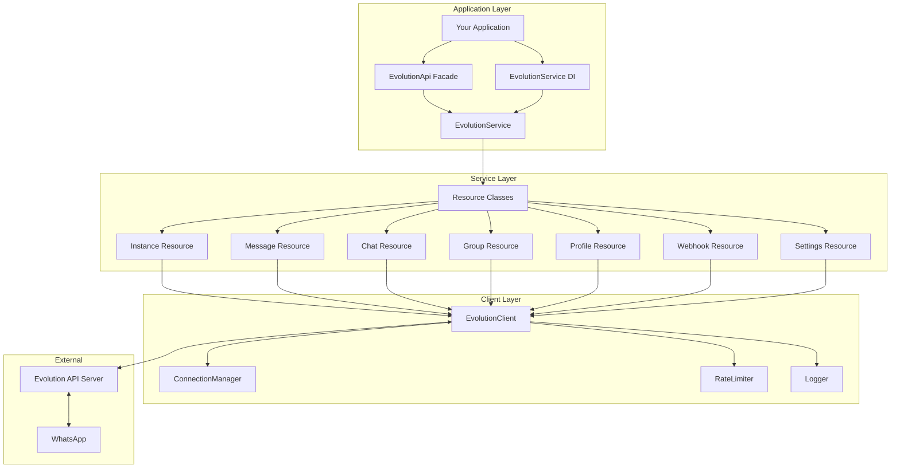
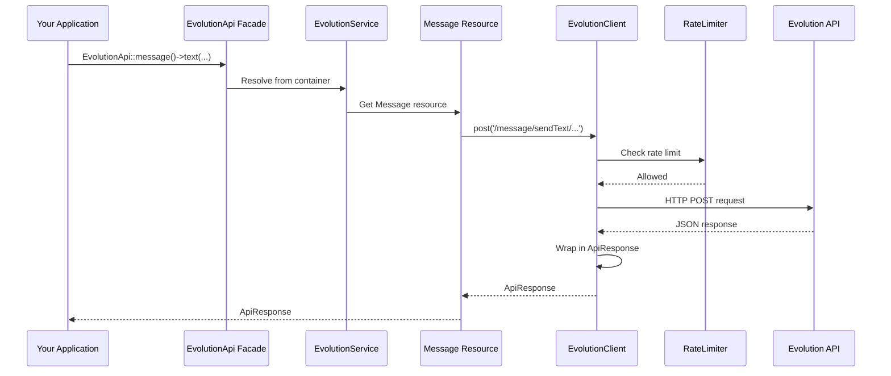
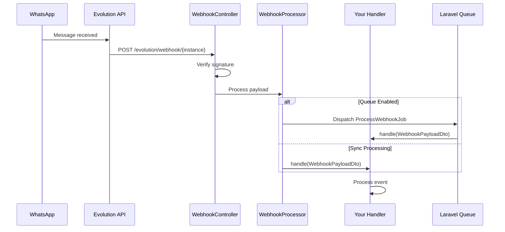
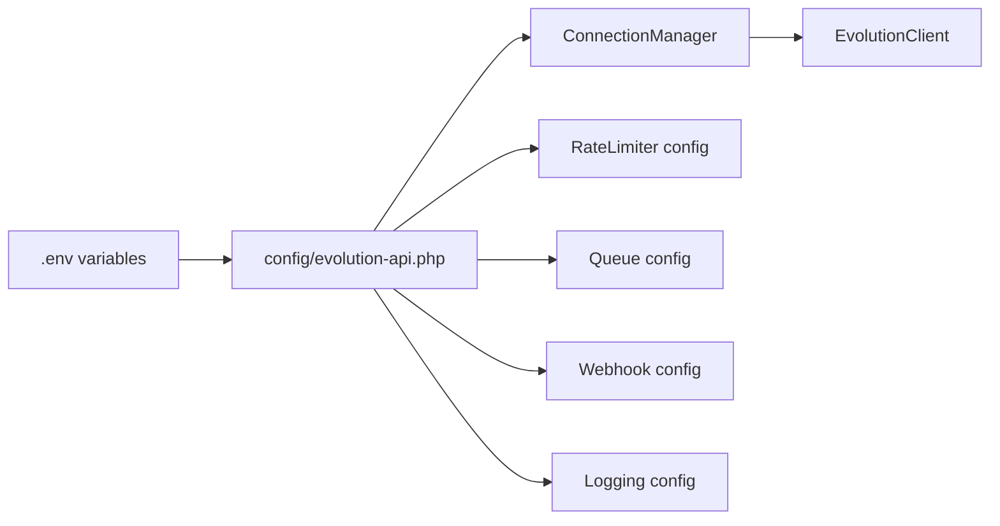
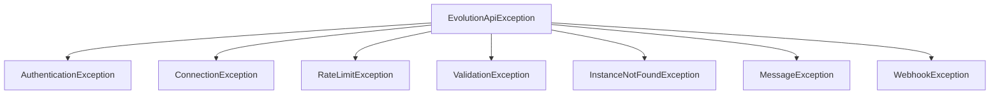

# Architecture Overview

This page explains the internal architecture of the Laravel Evolution API package, helping you understand how components work together.

## High-Level Architecture



## Core Components

### 1. EvolutionService

The main entry point for all API operations. It provides:

- Access to all resource classes (instances, messages, chats, etc.)
- Connection switching for multi-tenancy
- Shortcut methods for common operations
- Dependency injection support

```php
// The service is the main orchestrator
$service = app(EvolutionService::class);

// Access resources through the service
$service->instances()->fetchAll();
$service->messages()->text($to, $text);

// Switch connections
$service->connection('secondary')->instances()->fetchAll();
```

**Location:** `src/Services/EvolutionService.php`

### 2. EvolutionClient

The HTTP client that handles all communication with the Evolution API server:

- Builds and sends HTTP requests
- Handles authentication (API key headers)
- Implements retry logic with exponential backoff
- Rate limiting integration
- Error handling and exception mapping
- Request/response logging

```php
// The client handles low-level HTTP operations
$client->get('/instance/fetchInstances');
$client->post('/message/sendText/instance-name', $data);
```

**Location:** `src/Client/EvolutionClient.php`

### 3. ConnectionManager

Manages multiple Evolution API server connections for multi-tenancy:

- Stores connection configurations (URL, API key)
- Handles connection switching
- Supports runtime connection addition
- Validates connection configurations

```php
// Add a connection at runtime
$manager->addConnection('tenant-123', [
    'server_url' => 'https://tenant-api.example.com',
    'api_key' => 'tenant-api-key',
]);

// Switch active connection
$manager->setActiveConnection('tenant-123');
```

**Location:** `src/Client/ConnectionManager.php`

### 4. Resource Classes

Each API domain has a dedicated resource class:

| Resource | Purpose | Key Methods |
|----------|---------|-------------|
| `Instance` | Manage WhatsApp instances | `create()`, `delete()`, `connect()`, `getQrCode()` |
| `Message` | Send messages | `text()`, `image()`, `audio()`, `location()` |
| `Chat` | Chat operations | `fetchAll()`, `isOnWhatsApp()`, `markAsRead()` |
| `Group` | Group management | `create()`, `addParticipants()`, `updateSettings()` |
| `Profile` | Profile management | `fetch()`, `updateName()`, `updateStatus()` |
| `Webhook` | Webhook configuration | `set()`, `find()`, `update()` |
| `Settings` | Instance settings | `get()`, `update()` |

**Location:** `src/Resources/`

### 5. DTOs (Data Transfer Objects)

Strongly-typed objects for request/response data:

```php
// Message DTOs ensure type safety
$dto = SendTextMessageDto::from([
    'number' => '5511999999999',
    'text' => 'Hello!',
]);

// API responses are wrapped in ApiResponse
$response = $service->messages()->text($to, $text);
$response->isSuccessful(); // bool
$response->json('key.id'); // mixed
```

**Location:** `src/DTOs/`

---

## Request Flow

Here's how a typical request flows through the system:



### Step-by-Step Breakdown

1. **Facade Access**: Your code calls the `EvolutionApi` facade
2. **Service Resolution**: Laravel resolves `EvolutionService` from the container
3. **Resource Access**: The service returns the appropriate resource class
4. **Client Request**: The resource calls the client with endpoint and data
5. **Rate Limiting**: The client checks if the request is allowed
6. **HTTP Request**: The client sends the request to Evolution API
7. **Response Handling**: The response is wrapped in `ApiResponse`
8. **Return**: The response flows back to your application

---

## Webhook Flow

Incoming webhooks follow a different path:



### Webhook Components

| Component | Responsibility |
|-----------|---------------|
| `WebhookController` | Receives HTTP requests, verifies signatures |
| `WebhookProcessor` | Routes events to registered handlers |
| `AbstractWebhookHandler` | Base class for custom handlers |
| `ProcessWebhookJob` | Queue job for async processing |
| `WebhookPayloadDto` | Strongly-typed webhook data |

---

## Service Container Integration

The package registers these services in Laravel's container:

```php
// Main service (singleton)
$this->app->singleton(EvolutionService::class, function ($app) {
    return new EvolutionService(
        new ConnectionManager(config('evolution-api')),
        $app->make(RateLimiterInterface::class),
        $app->make(LoggerInterface::class)
    );
});

// Facade accessor
$this->app->alias(EvolutionService::class, 'evolution-api');

// Webhook processor (singleton)
$this->app->singleton(WebhookProcessor::class);
```

### Resolving Services

```php
// Via facade
EvolutionApi::messages()->text(...);

// Via dependency injection
public function __construct(EvolutionService $evolution) {}

// Via helper
evolution_api()->messages()->text(...);

// Via container
app(EvolutionService::class)->messages()->text(...);
```

---

## Configuration Loading

Configuration is loaded from `config/evolution-api.php`:



The `ConnectionManager` receives the full config array and extracts connection-specific settings as needed.

---

## Error Handling

The package uses a hierarchy of exceptions:



### Exception Mapping

| HTTP Status | Exception |
|-------------|-----------|
| 401, 403 | `AuthenticationException` |
| 404 (instance) | `InstanceNotFoundException` |
| 422 | `ValidationException` |
| 429 | `RateLimitException` |
| 5xx | `ConnectionException` |

```php
try {
    $response = EvolutionApi::messages()->text($to, $text);
} catch (RateLimitException $e) {
    // Handle rate limiting
    $retryAfter = $e->getRetryAfter();
} catch (InstanceNotFoundException $e) {
    // Instance doesn't exist
} catch (EvolutionApiException $e) {
    // General API error
}
```

---

## Extension Points

The package provides several extension points:

### Custom Webhook Handlers

```php
class MyHandler extends AbstractWebhookHandler
{
    protected array $events = ['MESSAGES_UPSERT'];
    
    public function handle(WebhookPayloadDto $payload): void
    {
        // Your logic
    }
}
```

### Custom Rate Limiter

```php
class MyRateLimiter implements RateLimiterInterface
{
    public function attempt(string $key, int $maxAttempts, int $decaySeconds): bool
    {
        // Your implementation
    }
}
```

### Runtime Connections

```php
// Add tenant connections dynamically
EvolutionApi::getConnectionManager()->addConnection('tenant-1', [
    'server_url' => $tenant->api_url,
    'api_key' => $tenant->api_key,
]);
```

---

## Directory Structure

```
src/
├── Client/
│   ├── EvolutionClient.php      # HTTP client
│   ├── ConnectionManager.php     # Multi-tenancy
│   └── RateLimiter.php          # Rate limiting
├── Console/
│   └── Commands/                 # Artisan commands
├── Contracts/                    # Interfaces
├── DTOs/
│   ├── ApiResponse.php          # Response wrapper
│   ├── WebhookPayloadDto.php    # Webhook data
│   └── Message/                  # Message DTOs
├── Enums/                        # Enumerations
├── Events/                       # Laravel events
├── Exceptions/                   # Custom exceptions
├── Facades/
│   └── EvolutionApi.php         # Laravel facade
├── Jobs/                         # Queue jobs
├── Models/                       # Eloquent models
├── Resources/                    # API resources
├── Services/
│   └── EvolutionService.php     # Main service
├── Testing/
│   └── Fakes/                   # Test doubles
├── Webhooks/                     # Webhook handling
└── EvolutionApiServiceProvider.php
```

---

## Next Steps

- [EvolutionClient](client.md) - Deep dive into the HTTP client
- [Service Container](service-container.md) - Laravel integration details
- [Services](../services/instances.md) - Learn about resource classes
