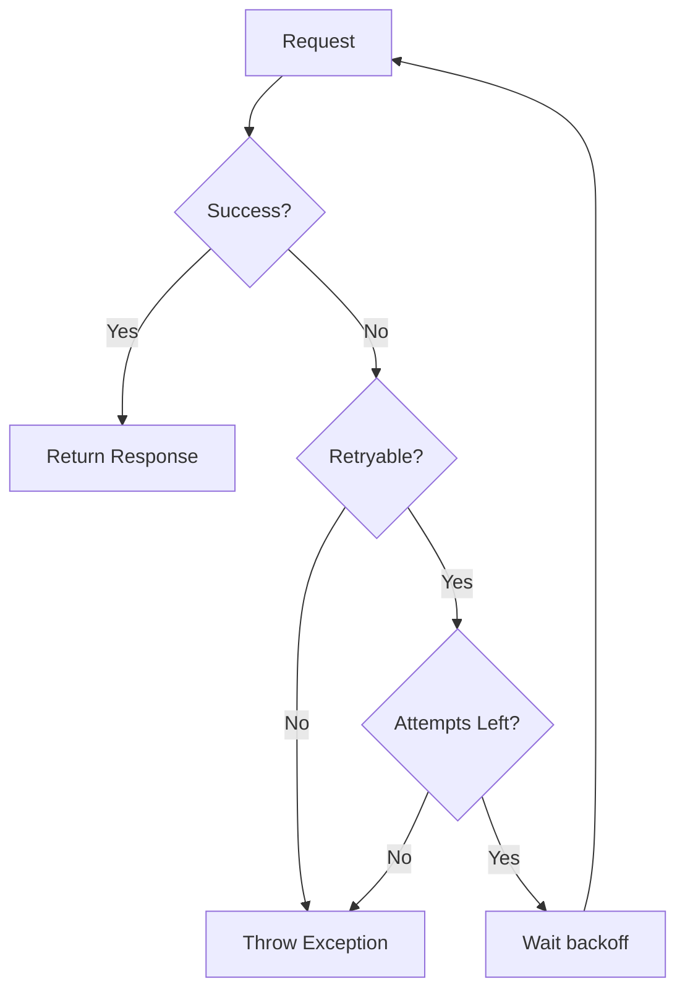

# EvolutionClient

The `EvolutionClient` is the core HTTP client that handles all communication with the Evolution API server. This page covers its features and advanced usage.

## Overview

The client provides:

- HTTP methods (GET, POST, PUT, DELETE, PATCH)
- Automatic authentication via API key headers
- Retry logic with configurable backoff strategies
- Rate limiting integration
- Request/response logging
- Error handling and exception mapping

## Basic Usage

While you typically interact with the client through the service and resource classes, you can access it directly:

```php
use Lynkbyte\EvolutionApi\Facades\EvolutionApi;

// Get the underlying client
$client = EvolutionApi::getClient();

// Make raw requests
$response = $client->get('/instance/fetchInstances');
$response = $client->post('/message/sendText/my-instance', [
    'number' => '5511999999999',
    'text' => 'Hello!',
]);
```

## HTTP Methods

### GET Request

```php
// Simple GET
$response = $client->get('/instance/fetchInstances');

// GET with query parameters
$response = $client->get('/chat/findChats/my-instance', [
    'limit' => 50,
    'offset' => 0,
]);
```

### POST Request

```php
$response = $client->post('/message/sendText/my-instance', [
    'number' => '5511999999999',
    'text' => 'Hello from Laravel!',
]);
```

### PUT Request

```php
$response = $client->put('/webhook/set/my-instance', [
    'url' => 'https://your-app.com/webhook',
    'events' => ['MESSAGES_UPSERT'],
]);
```

### DELETE Request

```php
$response = $client->delete('/instance/delete/my-instance');
```

### PATCH Request

```php
$response = $client->patch('/profile/updateName/my-instance', [
    'name' => 'New Business Name',
]);
```

## ApiResponse

All client methods return an `ApiResponse` object:

```php
$response = $client->post('/message/sendText/my-instance', $data);

// Check status
$response->isSuccessful();     // bool - 2xx status
$response->status();           // int - HTTP status code
$response->successful();       // alias for isSuccessful()
$response->failed();           // bool - 4xx or 5xx status

// Access data
$response->json();             // array - full response body
$response->json('key.id');     // mixed - nested value with dot notation
$response->body();             // string - raw response body
$response->headers();          // array - response headers

// Get original response
$response->toResponse();       // Illuminate\Http\Client\Response
```

### Working with Response Data

```php
$response = EvolutionApi::messages()->text('5511999999999', 'Hello!');

if ($response->isSuccessful()) {
    $messageId = $response->json('key.id');
    $remoteJid = $response->json('key.remoteJid');
    $status = $response->json('status');
    
    logger()->info("Message sent", [
        'id' => $messageId,
        'to' => $remoteJid,
    ]);
} else {
    $error = $response->json('message') ?? 'Unknown error';
    logger()->error("Failed to send message: {$error}");
}
```

## Instance Context

Set the instance for subsequent requests:

```php
// Set instance on client
$client->instance('my-instance');

// Or use the service's fluent interface
EvolutionApi::for('my-instance')->messages()->text($to, $text);
EvolutionApi::use('my-instance')->messages()->text($to, $text);
```

## Connection Switching

Switch between configured connections:

```php
// Use a different connection
$client->connection('secondary');

// Or via service
EvolutionApi::connection('secondary')->instances()->fetchAll();
```

## Authentication

The client automatically adds the API key header to all requests:

```php
// Header added automatically:
// apikey: your-api-key
```

The API key is retrieved from the active connection configuration.

## Retry Logic

The client automatically retries failed requests based on configuration:

```php
// config/evolution-api.php
'retry' => [
    'enabled' => true,
    'max_attempts' => 3,
    'backoff_strategy' => 'exponential', // fixed, linear, exponential
    'base_delay' => 1000,                // milliseconds
    'max_delay' => 30000,                // milliseconds
    'retryable_status_codes' => [408, 429, 500, 502, 503, 504],
],
```

### Backoff Strategies

| Strategy | Description | Delays (base=1000ms) |
|----------|-------------|---------------------|
| `fixed` | Same delay every retry | 1s, 1s, 1s |
| `linear` | Delay increases linearly | 1s, 2s, 3s |
| `exponential` | Delay doubles each retry | 1s, 2s, 4s |

### Retry Flow



## Rate Limiting

The client integrates with the rate limiter:

```php
// Rate limiting is automatic based on config
'rate_limiting' => [
    'enabled' => true,
    'limits' => [
        'default' => ['max_attempts' => 60, 'decay_seconds' => 60],
        'messages' => ['max_attempts' => 30, 'decay_seconds' => 60],
    ],
    'on_limit_reached' => 'wait', // wait, throw, skip
],
```

### Rate Limit Behaviors

| Behavior | Description |
|----------|-------------|
| `wait` | Sleep until rate limit resets, then retry |
| `throw` | Throw `RateLimitException` immediately |
| `skip` | Return null without making the request |

```php
try {
    $response = EvolutionApi::messages()->text($to, $text);
} catch (RateLimitException $e) {
    $retryAfter = $e->getRetryAfter(); // seconds
    logger()->warning("Rate limited. Retry after {$retryAfter}s");
}
```

## Logging

The client logs requests and responses when enabled:

```php
// config/evolution-api.php
'logging' => [
    'enabled' => true,
    'channel' => null,           // null = default Laravel channel
    'log_requests' => true,
    'log_responses' => true,
    'redact_sensitive' => true,
    'sensitive_fields' => ['apikey', 'api_key', 'token', 'password'],
],
```

### Log Output Example

```
[2024-01-15 10:30:00] local.INFO: Evolution API Request {
    "method": "POST",
    "url": "https://api.example.com/message/sendText/my-instance",
    "body": {"number": "5511999999999", "text": "Hello!"}
}

[2024-01-15 10:30:01] local.INFO: Evolution API Response {
    "status": 200,
    "body": {"key": {"id": "ABC123"}, "status": "PENDING"}
}
```

### Sensitive Data Redaction

Sensitive fields are automatically redacted:

```
// Before redaction
{"apikey": "secret-key-123", "number": "5511999999999"}

// After redaction
{"apikey": "[REDACTED]", "number": "5511999999999"}
```

## Error Handling

The client maps HTTP errors to specific exceptions:

```php
use Lynkbyte\EvolutionApi\Exceptions\{
    AuthenticationException,
    ConnectionException,
    InstanceNotFoundException,
    RateLimitException,
    ValidationException,
    EvolutionApiException,
};

try {
    $response = EvolutionApi::messages()->text($to, $text);
} catch (AuthenticationException $e) {
    // 401/403 - Invalid API key
    logger()->error('Authentication failed: ' . $e->getMessage());
    
} catch (InstanceNotFoundException $e) {
    // Instance doesn't exist
    logger()->error('Instance not found: ' . $e->getInstanceName());
    
} catch (ValidationException $e) {
    // 422 - Invalid request data
    $errors = $e->getErrors();
    logger()->error('Validation failed', ['errors' => $errors]);
    
} catch (RateLimitException $e) {
    // 429 - Too many requests
    $retryAfter = $e->getRetryAfter();
    logger()->warning("Rate limited. Retry after {$retryAfter}s");
    
} catch (ConnectionException $e) {
    // Network/server errors
    logger()->error('Connection failed: ' . $e->getMessage());
    
} catch (EvolutionApiException $e) {
    // Any other API error
    logger()->error('API error: ' . $e->getMessage());
}
```

### Exception Details

Each exception provides additional context:

```php
try {
    $response = EvolutionApi::messages()->text($to, $text);
} catch (EvolutionApiException $e) {
    $e->getMessage();        // Human-readable message
    $e->getCode();           // HTTP status code or error code
    $e->getErrorCode();      // API error code (e.g., 'INVALID_NUMBER')
    $e->getResponse();       // Original response (if available)
    $e->getContext();        // Additional context array
}
```

## Timeout Configuration

Configure request timeouts:

```php
// config/evolution-api.php
'http' => [
    'timeout' => 30,          // Request timeout in seconds
    'connect_timeout' => 10,  // Connection timeout in seconds
],
```

## SSL Verification

Configure SSL certificate verification:

```php
// config/evolution-api.php
'http' => [
    'verify_ssl' => true,  // Disable only in development!
],
```

!!! danger "Security Warning"
    Never disable SSL verification in production. Only use `verify_ssl: false` for local development with self-signed certificates.

## Ping and Health Check

Check if the API server is reachable:

```php
// Simple ping
$isReachable = EvolutionApi::ping();

// Get server info
$info = EvolutionApi::info();
```

## Advanced: Custom Headers

Add custom headers to requests:

```php
// The client adds these headers automatically:
// - apikey: {your-api-key}
// - Content-Type: application/json
// - Accept: application/json
```

## Advanced: Raw HTTP Client

Access the underlying Laravel HTTP client:

```php
$client = EvolutionApi::getClient();

// The client uses Laravel's Http facade internally
// with pre-configured options
```

## Debugging

Enable debug mode for verbose output:

```php
// config/evolution-api.php
'debug' => env('EVOLUTION_DEBUG', false),
```

When enabled:
- Full request/response bodies are logged
- Sensitive data redaction is disabled
- Detailed exception messages are shown

!!! warning "Production"
    Never enable debug mode in production as it may expose sensitive information.

---

## Next Steps

- [Service Container](service-container.md) - How services are registered
- [Rate Limiting](../advanced/rate-limiting.md) - Configure rate limits
- [Error Handling](../advanced/error-handling.md) - Handle errors gracefully
