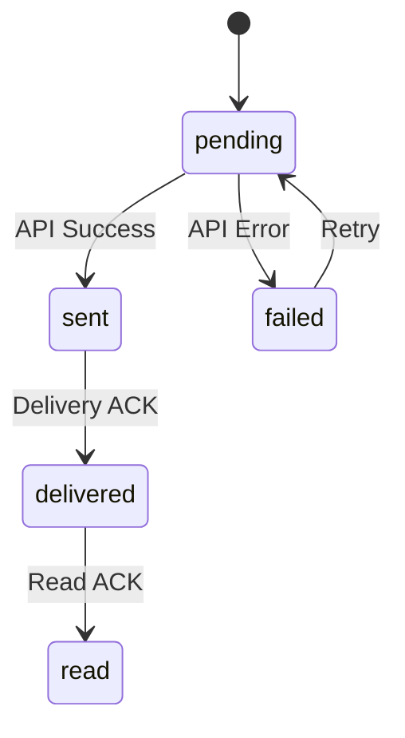

# Database Models

The package provides Eloquent models for persisting messages, webhooks, and instance data.

## Configuration

Enable database features:

```php
// config/evolution-api.php

'database' => [
    // Enable database storage
    'enabled' => env('EVOLUTION_DB_ENABLED', true),
    
    // Database connection (null = default)
    'connection' => env('EVOLUTION_DB_CONNECTION', null),
    
    // Table prefix
    'table_prefix' => env('EVOLUTION_TABLE_PREFIX', 'evolution_'),
    
    // What to store
    'store_messages' => env('EVOLUTION_STORE_MESSAGES', true),
    'store_webhooks' => env('EVOLUTION_STORE_WEBHOOKS', true),
    'store_instances' => env('EVOLUTION_STORE_INSTANCES', true),
    
    // Data retention (days)
    'prune_after_days' => env('EVOLUTION_PRUNE_DAYS', 30),
],
```

## Available Models

### EvolutionInstance

Tracks WhatsApp instances:

```php
use Lynkbyte\EvolutionApi\Models\EvolutionInstance;

// Create instance record
$instance = EvolutionInstance::create([
    'name' => 'my-instance',
    'display_name' => 'Production WhatsApp',
    'connection_name' => 'default',
    'phone_number' => '5511999999999',
    'status' => 'connected',
]);

// Query instances
$connected = EvolutionInstance::where('status', 'open')->get();

// Get instance with messages
$instance = EvolutionInstance::with('messages')->find(1);
```

**Schema:**

| Column | Type | Description |
|--------|------|-------------|
| `id` | bigint | Primary key |
| `name` | string | Instance name (unique) |
| `display_name` | string | Human-friendly name |
| `connection_name` | string | Evolution API connection |
| `phone_number` | string | Connected phone number |
| `status` | string | Connection status |
| `profile_name` | string | WhatsApp profile name |
| `profile_picture_url` | string | Profile picture URL |
| `settings` | json | Instance settings |
| `webhook_config` | json | Webhook configuration |
| `connected_at` | timestamp | Last connected time |
| `disconnected_at` | timestamp | Last disconnected time |
| `last_seen_at` | timestamp | Last activity time |
| `created_at` | timestamp | Created timestamp |
| `updated_at` | timestamp | Updated timestamp |
| `deleted_at` | timestamp | Soft delete timestamp |

### EvolutionMessage

Stores sent and received messages:

```php
use Lynkbyte\EvolutionApi\Models\EvolutionMessage;

// Create message record
$message = EvolutionMessage::create([
    'message_id' => 'BAE5F5B1C2A3D4E6',
    'instance_name' => 'my-instance',
    'remote_jid' => '5511999999999@s.whatsapp.net',
    'from_me' => true,
    'message_type' => 'text',
    'status' => 'pending',
    'content' => 'Hello, World!',
]);

// Update status
$message->markAsSent(['key' => ['id' => '...']]);
$message->markAsDelivered();
$message->markAsRead();

// Query messages
$pending = EvolutionMessage::pending()->get();
$failed = EvolutionMessage::failed()->get();
$outgoing = EvolutionMessage::forInstance('my-instance')->outgoing()->get();
```

**Schema:**

| Column | Type | Description |
|--------|------|-------------|
| `id` | bigint | Primary key |
| `message_id` | string | WhatsApp message ID |
| `instance_name` | string | Instance name |
| `remote_jid` | string | Recipient/sender JID |
| `from_me` | boolean | Outgoing message? |
| `message_type` | string | Message type |
| `status` | string | Delivery status |
| `content` | text | Text content |
| `media` | json | Media information |
| `payload` | json | Full request payload |
| `response` | json | API response |
| `error_message` | string | Error if failed |
| `retry_count` | integer | Retry attempts |
| `sent_at` | timestamp | Sent time |
| `delivered_at` | timestamp | Delivered time |
| `read_at` | timestamp | Read time |
| `failed_at` | timestamp | Failed time |

**Message Status Flow:**



### EvolutionWebhookLog

Logs incoming webhooks:

```php
use Lynkbyte\EvolutionApi\Models\EvolutionWebhookLog;

// Query webhook logs
$logs = EvolutionWebhookLog::where('instance_name', 'my-instance')
    ->where('event', 'MESSAGES_UPSERT')
    ->latest()
    ->get();

// Get unprocessed webhooks
$unprocessed = EvolutionWebhookLog::where('processed', false)->get();
```

### EvolutionContact

Stores contact information:

```php
use Lynkbyte\EvolutionApi\Models\EvolutionContact;

// Find or create contact
$contact = EvolutionContact::firstOrCreate(
    ['jid' => '5511999999999@s.whatsapp.net', 'instance_name' => 'my-instance'],
    ['name' => 'John Doe', 'push_name' => 'John']
);
```

## Model Methods

### EvolutionMessage

```php
$message = EvolutionMessage::find(1);

// Status checks
$message->isSent();      // Has been sent?
$message->isDelivered(); // Has been delivered?
$message->isRead();      // Has been read?
$message->isFailed();    // Has failed?
$message->isPending();   // Still pending?

// Status updates
$message->markAsSent($response);
$message->markAsDelivered();
$message->markAsRead();
$message->markAsFailed('Error message');
$message->incrementRetry();

// Type helpers
$message->getMessageTypeEnum();  // MessageType enum
$message->getStatusEnum();       // MessageStatus enum

// Find by ID
$message = EvolutionMessage::findByMessageId('BAE5...', 'my-instance');
```

### EvolutionInstance

```php
$instance = EvolutionInstance::find(1);

// Relationships
$instance->messages;         // All messages
$instance->contacts;         // All contacts
$instance->webhookLogs;      // All webhook logs

// Status helpers
$instance->isConnected();
$instance->isDisconnected();
```

## Query Scopes

### EvolutionMessage Scopes

```php
use Lynkbyte\EvolutionApi\Models\EvolutionMessage;

// By instance
EvolutionMessage::forInstance('my-instance')->get();

// By status
EvolutionMessage::withStatus('sent')->get();
EvolutionMessage::pending()->get();
EvolutionMessage::failed()->get();

// By direction
EvolutionMessage::outgoing()->get();  // from_me = true
EvolutionMessage::incoming()->get();  // from_me = false

// Retryable (failed but under retry limit)
EvolutionMessage::retryable(3)->get();
```

### Combining Scopes

```php
// Failed outgoing messages for specific instance
$messages = EvolutionMessage::forInstance('my-instance')
    ->outgoing()
    ->failed()
    ->where('created_at', '>=', now()->subDay())
    ->get();

// Pending messages ready for retry
$messages = EvolutionMessage::forInstance('my-instance')
    ->retryable(maxRetries: 3)
    ->where('failed_at', '<', now()->subMinutes(5))
    ->get();
```

## Relationships

### Instance to Messages

```php
$instance = EvolutionInstance::with('messages')->find(1);

// Recent messages
$recentMessages = $instance->messages()
    ->latest()
    ->take(10)
    ->get();

// Unread messages
$unread = $instance->messages()
    ->incoming()
    ->where('read_at', null)
    ->get();
```

### Message to Instance

```php
$message = EvolutionMessage::find(1);
$instance = $message->instance;
```

## Custom Models

Extend the models for custom behavior:

```php
// app/Models/WhatsAppMessage.php
namespace App\Models;

use Lynkbyte\EvolutionApi\Models\EvolutionMessage;

class WhatsAppMessage extends EvolutionMessage
{
    // Add custom relationships
    public function customer()
    {
        return $this->belongsTo(Customer::class, 'remote_jid', 'whatsapp_jid');
    }
    
    // Add custom scopes
    public function scopeFromCustomer($query, Customer $customer)
    {
        return $query->where('remote_jid', $customer->whatsapp_jid);
    }
    
    // Add custom methods
    public function isFromSupport(): bool
    {
        return $this->from_me && $this->instance->is_support_instance;
    }
}
```

## Events

Models fire standard Eloquent events:

```php
// In EventServiceProvider
EvolutionMessage::created(function ($message) {
    Log::info("Message created: {$message->message_id}");
});

EvolutionMessage::updated(function ($message) {
    if ($message->wasChanged('status')) {
        Log::info("Message status changed to: {$message->status}");
    }
});
```

## Best Practices

### 1. Use Eager Loading

```php
// Avoid N+1 queries
$messages = EvolutionMessage::with('instance')
    ->forInstance('my-instance')
    ->get();
```

### 2. Index Your Queries

The migrations include indexes for common queries. Add custom indexes if needed:

```php
// Additional indexes for your use case
Schema::table('evolution_messages', function (Blueprint $table) {
    $table->index(['remote_jid', 'created_at']);
});
```

### 3. Use Chunking for Bulk Operations

```php
EvolutionMessage::forInstance('my-instance')
    ->failed()
    ->chunk(100, function ($messages) {
        foreach ($messages as $message) {
            RetryMessageJob::dispatch($message);
        }
    });
```

### 4. Prune Old Data

```php
// In a scheduled command
$deleted = EvolutionMessage::where('created_at', '<', now()->subDays(30))
    ->where('status', 'read')
    ->delete();
```
