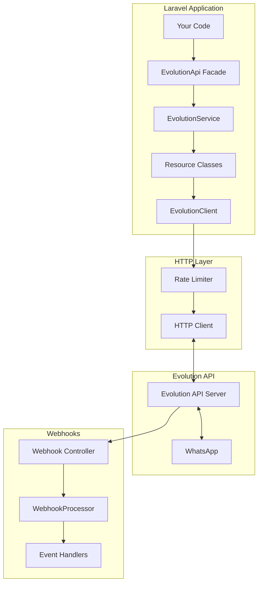

# Laravel Evolution API

<p align="center">
  <a href="https://github.com/lynkbyte/laravel-evolution-api/actions/workflows/tests.yml"></a>
  <a href="https://packagist.org/packages/lynkbyte/laravel-evolution-api"></a>
  <a href="https://packagist.org/packages/lynkbyte/laravel-evolution-api"></a>
  <a href="https://packagist.org/packages/lynkbyte/laravel-evolution-api"></a>
</p>

<p class="hero-description" style="text-align: center; font-size: 1.2em; margin: 2em 0;">
A production-ready Laravel package for seamless integration with <a href="https://github.com/EvolutionAPI/evolution-api">Evolution API</a> - the powerful WhatsApp messaging solution.
</p>

---

## Why Laravel Evolution API?

This package provides everything you need to integrate WhatsApp messaging into your Laravel application with a clean, fluent API.

<div class="grid cards" markdown>

-   :material-message-text:{ .lg .middle } **Full API Coverage**

    ---

    Instance management, messaging, groups, profiles, webhooks, and settings - all through a clean Laravel interface.

    [:octicons-arrow-right-24: Services](services/instances.md)

-   :material-image-multiple:{ .lg .middle } **Rich Message Types**

    ---

    Send text, images, videos, audio, documents, locations, contacts, polls, lists, buttons, and reactions.

    [:octicons-arrow-right-24: Messaging](messaging/text-messages.md)

-   :material-cog-sync:{ .lg .middle } **Queue Support**

    ---

    Send messages asynchronously with Laravel's queue system for better performance and reliability.

    [:octicons-arrow-right-24: Queues](queues/overview.md)

-   :material-webhook:{ .lg .middle } **Webhook Processing**

    ---

    Built-in webhook controller with signature verification and extensible event handlers.

    [:octicons-arrow-right-24: Webhooks](webhooks/overview.md)

-   :material-speedometer:{ .lg .middle } **Rate Limiting**

    ---

    Configurable rate limits to respect API constraints and prevent throttling.

    [:octicons-arrow-right-24: Rate Limiting](advanced/rate-limiting.md)

-   :material-chart-line:{ .lg .middle } **Metrics & Logging**

    ---

    Track message counts, API calls, and errors with multiple driver support.

    [:octicons-arrow-right-24: Metrics](advanced/metrics.md)

-   :material-database:{ .lg .middle } **Database Models**

    ---

    Eloquent models for instances, messages, contacts, and webhook logs with automatic tracking.

    [:octicons-arrow-right-24: Database](database/models.md)

-   :material-test-tube:{ .lg .middle } **Testing Utilities**

    ---

    Fake implementation with fluent assertions for unit testing your application.

    [:octicons-arrow-right-24: Testing](testing/fakes.md)

</div>

---

## Quick Installation

```bash
composer require lynkbyte/laravel-evolution-api
php artisan evolution-api:install
```

Add your Evolution API credentials to `.env`:

```env
EVOLUTION_API_BASE_URL=https://your-evolution-api-server.com
EVOLUTION_API_KEY=your-api-key
EVOLUTION_API_WEBHOOK_SECRET=your-webhook-secret
```

[:octicons-arrow-right-24: Full Installation Guide](getting-started/installation.md)

---

## Quick Example

### Send a Text Message

```php
use Lynkbyte\EvolutionApi\Facades\EvolutionApi;

// Send a simple text message
$response = EvolutionApi::message()->sendText('my-instance', [
    'number' => '5511999999999',
    'text' => 'Hello from Laravel!',
]);

// Check if it was successful
if ($response->successful()) {
    $messageId = $response->json('key.id');
}
```

### Send a Media Message

```php
// Send an image with caption
$response = EvolutionApi::message()->sendMedia('my-instance', [
    'number' => '5511999999999',
    'mediatype' => 'image',
    'media' => 'https://example.com/image.jpg',
    'caption' => 'Check out this image!',
]);
```

### Handle Webhooks

```php
use Lynkbyte\EvolutionApi\Webhooks\AbstractWebhookHandler;
use Lynkbyte\EvolutionApi\DTOs\WebhookPayloadDto;

class MessageReceivedHandler extends AbstractWebhookHandler
{
    public function handle(WebhookPayloadDto $payload): void
    {
        $message = $payload->data['message'] ?? [];
        
        // Process the incoming message
        logger()->info('Message received', [
            'from' => $payload->sender,
            'text' => $message['conversation'] ?? null,
        ]);
    }
}
```

[:octicons-arrow-right-24: Quick Start Guide](getting-started/quick-start.md)

---

## Requirements

| Requirement | Version |
|-------------|---------|
| PHP | 8.2+ |
| Laravel | 11.x / 12.x |
| Evolution API | 2.x |

---

## Architecture Overview



[:octicons-arrow-right-24: Architecture Details](core-concepts/architecture.md)

---

## Support

<div class="grid cards" markdown>

-   :octicons-mark-github-16:{ .lg .middle } **GitHub**

    ---

    Report issues, request features, or contribute to the project.

    [:octicons-arrow-right-24: GitHub Repository](https://github.com/lynkbyte/laravel-evolution-api)

-   :material-package-variant:{ .lg .middle } **Packagist**

    ---

    View package details and version history.

    [:octicons-arrow-right-24: Packagist](https://packagist.org/packages/lynkbyte/laravel-evolution-api)

</div>

---

## License

Laravel Evolution API is open-sourced software licensed under the [MIT license](https://opensource.org/licenses/MIT).

<p style="text-align: center; margin-top: 3em; color: var(--md-default-fg-color--light);">
Made with :heart: by <a href="https://lynkbyte.com">Lynkbyte</a>
</p>
