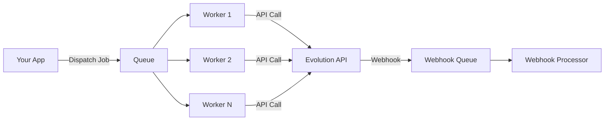

# Queue System Overview

The Laravel Evolution API package provides robust queue support for reliable message sending and webhook processing.

## Why Use Queues?

Queues provide several benefits:

- **Faster Responses** - API requests return immediately
- **Reliability** - Failed jobs are automatically retried
- **Scalability** - Process thousands of messages concurrently
- **Rate Limiting** - Control message throughput
- **Monitoring** - Track job status with Laravel Horizon

## Architecture



## Configuration

Enable queues in your configuration:

```php
// config/evolution-api.php

'queue' => [
    // Enable queue processing
    'enabled' => env('EVOLUTION_QUEUE_ENABLED', true),
    
    // Queue connection (null = default)
    'connection' => env('EVOLUTION_QUEUE_CONNECTION', 'redis'),
    
    // Queue name for jobs
    'queue' => env('EVOLUTION_QUEUE_NAME', 'evolution-api'),
    
    // Seconds before retrying failed jobs
    'retry_after' => env('EVOLUTION_QUEUE_RETRY_AFTER', 90),
    
    // Maximum retries before job fails
    'max_exceptions' => env('EVOLUTION_QUEUE_MAX_EXCEPTIONS', 3),
    
    // Backoff between retries (seconds)
    'backoff' => [60, 300, 900], // 1min, 5min, 15min
],
```

## Available Jobs

### SendMessageJob

Sends messages via queue:

```php
use Lynkbyte\EvolutionApi\Jobs\SendMessageJob;

// Queue a text message
SendMessageJob::text(
    instanceName: 'my-instance',
    number: '5511999999999',
    text: 'Hello from queue!'
)->dispatch();

// Queue a media message
SendMessageJob::media(
    instanceName: 'my-instance',
    number: '5511999999999',
    mediatype: 'image',
    media: 'https://example.com/image.jpg',
    options: ['caption' => 'Check this out!']
)->dispatch();
```

### ProcessWebhookJob

Processes webhooks via queue:

```php
use Lynkbyte\EvolutionApi\Jobs\ProcessWebhookJob;

// Dispatch webhook for processing
ProcessWebhookJob::dispatch($payload, $instanceName)
    ->onQueue('webhooks');

// Or use the static constructor
ProcessWebhookJob::fromWebhook($webhookData)->dispatch();
```

## Running Workers

Start queue workers to process jobs:

```bash
# Basic worker
php artisan queue:work --queue=evolution-api

# With specific connection
php artisan queue:work redis --queue=evolution-api

# Multiple queues with priority
php artisan queue:work --queue=evolution-api,webhooks

# In production (with Supervisor)
php artisan queue:work redis --queue=evolution-api --sleep=3 --tries=3
```

## Queue Separation

Separate queues for different job types:

```php
// config/evolution-api.php
'queue' => [
    'queue' => 'evolution-messages',      // For sending messages
    'webhook_queue' => 'evolution-webhooks', // For webhooks
],
```

Run separate workers:

```bash
# Message worker
php artisan queue:work --queue=evolution-messages

# Webhook worker  
php artisan queue:work --queue=evolution-webhooks
```

## Laravel Horizon

For production, use Laravel Horizon for queue monitoring:

```php
// config/horizon.php
'environments' => [
    'production' => [
        'evolution-supervisor' => [
            'connection' => 'redis',
            'queue' => ['evolution-api', 'evolution-webhooks'],
            'balance' => 'auto',
            'processes' => 10,
            'tries' => 3,
            'timeout' => 60,
        ],
    ],
],
```

## Job Tags

Jobs are automatically tagged for easy filtering in Horizon:

```php
// SendMessageJob tags
[
    'evolution-api',
    'message',
    'instance:my-instance',
    'type:text',
]

// ProcessWebhookJob tags
[
    'evolution-api',
    'webhook',
    'instance:my-instance',
    'event:MESSAGES_UPSERT',
]
```

## Error Handling

### Automatic Retries

Jobs automatically retry on failure:

```php
// Default retry behavior
public int $tries = 3;
public array $backoff = [60, 300, 900];
```

### Failed Job Handling

Handle permanently failed jobs:

```php
// In your job or listener
public function failed(\Throwable $exception): void
{
    Log::error('Message job failed', [
        'instance' => $this->instanceName,
        'message' => $this->message,
        'error' => $exception->getMessage(),
    ]);
    
    // Notify team
    Notification::route('slack', config('services.slack.webhook'))
        ->notify(new MessageJobFailed($this, $exception));
}
```

### Event Handling

Listen to job events:

```php
use Lynkbyte\EvolutionApi\Events\MessageSent;
use Lynkbyte\EvolutionApi\Events\MessageFailed;

// Successful message
Event::listen(MessageSent::class, function ($event) {
    Log::info("Message sent to {$event->message['number']}");
});

// Failed message
Event::listen(MessageFailed::class, function ($event) {
    Log::error("Message failed: {$event->exception->getMessage()}");
});
```

## Synchronous Mode

Disable queues for synchronous processing:

```php
// config/evolution-api.php
'queue' => [
    'enabled' => false,
],
```

Or per-request:

```php
use Lynkbyte\EvolutionApi\Facades\EvolutionApi;

// Force synchronous execution
$response = EvolutionApi::for('my-instance')
    ->messages()
    ->sendText('5511999999999', 'Sync message');
```

## Best Practices

### 1. Use Redis for Production

```bash
# .env
QUEUE_CONNECTION=redis
EVOLUTION_QUEUE_CONNECTION=redis
```

### 2. Set Appropriate Timeouts

```php
'queue' => [
    'retry_after' => 90,  // Job timeout + buffer
],
```

### 3. Monitor Queue Health

```php
// Check queue size
$size = Queue::size('evolution-api');

// Alert if backlog is too large
if ($size > 1000) {
    alert('Queue backlog critical!');
}
```

### 4. Use Supervisor in Production

```ini
; /etc/supervisor/conf.d/evolution-worker.conf
[program:evolution-worker]
process_name=%(program_name)s_%(process_num)02d
command=php /var/www/artisan queue:work redis --queue=evolution-api --sleep=3 --tries=3 --max-time=3600
autostart=true
autorestart=true
stopasgroup=true
killasgroup=true
numprocs=8
redirect_stderr=true
stdout_logfile=/var/www/storage/logs/worker.log
```

## Next Steps

- [SendMessageJob](send-message-job.md) - Detailed job documentation
- [ProcessWebhookJob](webhook-job.md) - Webhook job documentation
- [Error Handling](../advanced/error-handling.md) - Error handling strategies
