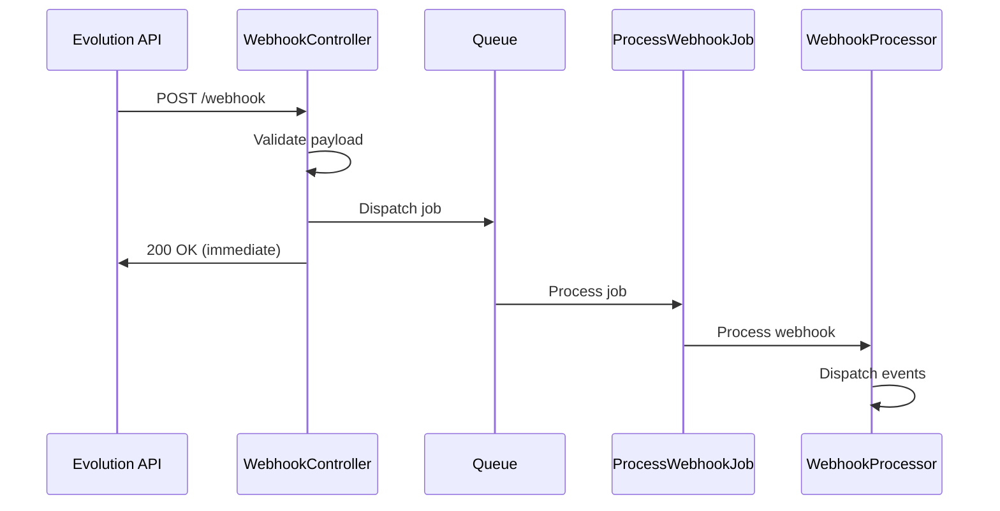

# ProcessWebhookJob

The `ProcessWebhookJob` handles asynchronous webhook processing for reliable event handling.

## Overview

When webhook queuing is enabled, incoming webhooks are immediately acknowledged and queued for background processing:

```php
use Lynkbyte\EvolutionApi\Jobs\ProcessWebhookJob;

// Automatically dispatched by WebhookController
ProcessWebhookJob::dispatch($payload, $instanceName);
```

## Class Reference

```php
namespace Lynkbyte\EvolutionApi\Jobs;

class ProcessWebhookJob implements ShouldQueue
{
    public readonly array $payload;
    public readonly ?string $instanceName;
    public readonly ?string $event;
    
    public int $tries = 3;
    public array $backoff = [10, 30, 60];
}
```

## Configuration

Enable webhook queuing:

```php
// config/evolution-api.php

'webhook' => [
    'queue_processing' => env('EVOLUTION_WEBHOOK_QUEUE', true),
],

'queue' => [
    'connection' => 'redis',
    'queue' => 'evolution-api',
],
```

## How It Works



## Creating Jobs

### From Controller (Automatic)

The `WebhookController` automatically dispatches jobs:

```php
// In WebhookController
protected function queueWebhook(array $payload): JsonResponse
{
    ProcessWebhookJob::dispatch($payload, $instanceName)
        ->onQueue($this->getQueueName());

    return response()->json(['status' => 'success', 'message' => 'Webhook queued']);
}
```

### Manual Dispatch

```php
use Lynkbyte\EvolutionApi\Jobs\ProcessWebhookJob;

// Basic dispatch
ProcessWebhookJob::dispatch($payload);

// With instance name
ProcessWebhookJob::dispatch($payload, 'my-instance');

// With all metadata
ProcessWebhookJob::dispatch($payload, 'my-instance', 'MESSAGES_UPSERT');
```

### Using Static Constructor

```php
// From raw webhook data
$job = ProcessWebhookJob::fromWebhook([
    'event' => 'MESSAGES_UPSERT',
    'instance' => 'my-instance',
    'data' => [...],
]);

$job->dispatch();
```

## Job Execution

When the job runs:

```php
public function handle(WebhookProcessor $processor): void
{
    // 1. Create DTO from payload
    $dto = WebhookPayloadDto::fromPayload($this->payload);

    // 2. Dispatch WebhookReceived event
    event(new WebhookReceived(
        instanceName: $dto->instanceName,
        event: $dto->event,
        payload: $dto->data,
        webhookEvent: $dto->webhookEvent
    ));

    // 3. Process through WebhookProcessor
    $processor->process($this->payload);
}
```

## Job Tags

Jobs are tagged for monitoring:

```php
public function tags(): array
{
    return [
        'evolution-api',
        'webhook',
        "instance:{$this->instanceName}",
        "event:{$this->event}",
    ];
}
```

In Laravel Horizon:
- `evolution-api` - All Evolution API jobs
- `webhook` - All webhook jobs
- `instance:my-instance` - Jobs for specific instance
- `event:MESSAGES_UPSERT` - Specific event type

## Retry Configuration

### Default Settings

```php
public int $tries = 3;
public array $backoff = [10, 30, 60]; // seconds
```

### Custom Configuration

Override in a custom job:

```php
use Lynkbyte\EvolutionApi\Jobs\ProcessWebhookJob;

class CustomWebhookJob extends ProcessWebhookJob
{
    public int $tries = 5;
    public array $backoff = [5, 15, 30, 60, 120];
    
    public function retryUntil(): DateTime
    {
        return now()->addHours(1);
    }
}
```

## Error Handling

### Automatic Retries

Failed jobs are automatically retried with exponential backoff:

1. First retry: 10 seconds
2. Second retry: 30 seconds
3. Third retry: 60 seconds

### Handling Failed Jobs

```php
use Lynkbyte\EvolutionApi\Jobs\ProcessWebhookJob;

class CustomWebhookJob extends ProcessWebhookJob
{
    public function failed(\Throwable $exception): void
    {
        Log::error('Webhook processing failed permanently', [
            'payload' => $this->payload,
            'instance' => $this->instanceName,
            'event' => $this->event,
            'error' => $exception->getMessage(),
        ]);
        
        // Store for manual review
        DB::table('failed_webhooks')->insert([
            'payload' => json_encode($this->payload),
            'instance' => $this->instanceName,
            'event' => $this->event,
            'error' => $exception->getMessage(),
            'failed_at' => now(),
        ]);
        
        // Notify team
        Notification::route('slack', config('services.slack.webhook'))
            ->notify(new WebhookProcessingFailed($this, $exception));
    }
}
```

## Separate Webhook Queue

Run webhooks on a dedicated queue:

```php
// config/evolution-api.php
'webhook' => [
    'queue_processing' => true,
],

'queue' => [
    'queue' => 'evolution-messages',
    'webhook_queue' => 'evolution-webhooks',  // Separate queue
],
```

Run separate workers:

```bash
# Message worker
php artisan queue:work --queue=evolution-messages

# Webhook worker
php artisan queue:work --queue=evolution-webhooks
```

## Priority Processing

### High Priority Events

Process certain events faster:

```php
use Lynkbyte\EvolutionApi\Jobs\ProcessWebhookJob;

class PriorityWebhookJob extends ProcessWebhookJob
{
    public function __construct(
        array $payload,
        ?string $instanceName = null,
        ?string $event = null
    ) {
        parent::__construct($payload, $instanceName, $event);
        
        // Connection events go to high-priority queue
        if (in_array($event, ['CONNECTION_UPDATE', 'QRCODE_UPDATED'])) {
            $this->onQueue('high-priority');
        }
    }
}
```

### Custom Dispatching

```php
// In custom WebhookController
protected function queueWebhook(array $payload): JsonResponse
{
    $event = $payload['event'] ?? '';
    $queue = $this->getQueueForEvent($event);
    
    ProcessWebhookJob::dispatch($payload)
        ->onQueue($queue);

    return response()->json(['status' => 'success']);
}

private function getQueueForEvent(string $event): string
{
    return match ($event) {
        'CONNECTION_UPDATE', 'QRCODE_UPDATED' => 'critical',
        'MESSAGES_UPSERT', 'MESSAGES_UPDATE' => 'messages',
        default => 'webhooks',
    };
}
```

## Batch Processing

Reprocess multiple webhooks:

```php
use Illuminate\Support\Facades\Bus;
use Lynkbyte\EvolutionApi\Jobs\ProcessWebhookJob;

// Reprocess failed webhooks
$failedWebhooks = DB::table('failed_webhooks')
    ->where('status', 'pending_retry')
    ->get();

$jobs = $failedWebhooks->map(function ($webhook) {
    return ProcessWebhookJob::fromWebhook(json_decode($webhook->payload, true));
});

Bus::batch($jobs)
    ->name('webhook-reprocess')
    ->allowFailures()
    ->dispatch();
```

## Monitoring

### Queue Size

```php
use Illuminate\Support\Facades\Queue;

$webhookQueueSize = Queue::size('evolution-webhooks');

if ($webhookQueueSize > 1000) {
    Log::warning('Webhook queue backlog is high', ['size' => $webhookQueueSize]);
}
```

### Job Metrics

Track processing time:

```php
class CustomWebhookJob extends ProcessWebhookJob
{
    public function handle(WebhookProcessor $processor): void
    {
        $start = microtime(true);
        
        parent::handle($processor);
        
        $duration = microtime(true) - $start;
        
        Metrics::timing('webhook_processing_time', $duration, [
            'event' => $this->event,
            'instance' => $this->instanceName,
        ]);
    }
}
```

### Horizon Configuration

```php
// config/horizon.php
'environments' => [
    'production' => [
        'webhook-supervisor' => [
            'connection' => 'redis',
            'queue' => ['evolution-webhooks'],
            'balance' => 'auto',
            'minProcesses' => 2,
            'maxProcesses' => 10,
            'balanceMaxShift' => 1,
            'balanceCooldown' => 3,
            'tries' => 3,
            'timeout' => 60,
        ],
    ],
],
```

## Example: Custom Processing Pipeline

```php
namespace App\Jobs;

use Lynkbyte\EvolutionApi\Jobs\ProcessWebhookJob;
use Lynkbyte\EvolutionApi\Webhooks\WebhookProcessor;
use App\Services\MessageStorageService;
use App\Services\AnalyticsService;

class EnhancedWebhookJob extends ProcessWebhookJob
{
    public function handle(
        WebhookProcessor $processor,
        MessageStorageService $storage,
        AnalyticsService $analytics
    ): void {
        // Track analytics
        $analytics->trackWebhook($this->event, $this->instanceName);
        
        // Store raw webhook
        $storage->storeWebhook($this->payload);
        
        // Process normally
        parent::handle($processor);
        
        // Post-processing
        if ($this->event === 'MESSAGES_UPSERT') {
            $storage->indexMessage($this->payload);
        }
    }
}
```

## Example: Conditional Processing

```php
namespace App\Jobs;

use Lynkbyte\EvolutionApi\Jobs\ProcessWebhookJob;
use Lynkbyte\EvolutionApi\Webhooks\WebhookProcessor;

class ConditionalWebhookJob extends ProcessWebhookJob
{
    public function handle(WebhookProcessor $processor): void
    {
        // Skip certain events in specific conditions
        if ($this->shouldSkip()) {
            return;
        }
        
        parent::handle($processor);
    }
    
    private function shouldSkip(): bool
    {
        // Skip presence updates during high load
        if ($this->event === 'PRESENCE_UPDATE') {
            return Cache::get('high_load_mode', false);
        }
        
        // Skip for disabled instances
        $instance = Instance::where('name', $this->instanceName)->first();
        if ($instance && !$instance->webhooks_enabled) {
            return true;
        }
        
        return false;
    }
}
```
