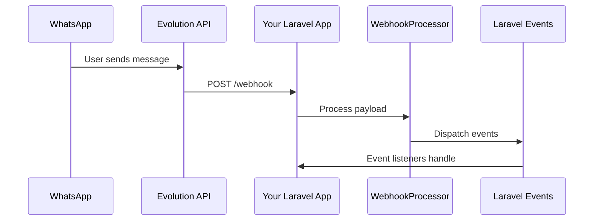

# Webhooks Overview

This guide covers how to receive and process webhooks from Evolution API using the Laravel Evolution API package.

## What Are Webhooks?

Webhooks are HTTP callbacks that Evolution API sends to your application when events occur, such as:

- Receiving a new message
- Message delivery confirmations
- Connection status changes
- QR code generation
- Group updates
- And more...

## Architecture



## Quick Setup

### 1. Configure Webhook URL

In your Evolution API instance, set the webhook URL to point to your Laravel application:

```
https://your-app.com/evolution-api/webhook
```

### 2. Enable the Route

The package automatically registers webhook routes. Ensure your route is accessible:

```php
// Routes registered automatically:
// POST /evolution-api/webhook
// POST /evolution-api/webhook/{instance}
// GET  /evolution-api/webhook/health
```

### 3. Configure Processing

```php
// config/evolution-api.php

'webhook' => [
    // Process webhooks via queue (recommended for production)
    'queue' => env('EVOLUTION_WEBHOOK_QUEUE', true),
    
    // Verify webhook signatures
    'verify_signature' => env('EVOLUTION_WEBHOOK_VERIFY', true),
    
    // Webhook secret for verification
    'secret' => env('EVOLUTION_WEBHOOK_SECRET'),
],
```

## Processing Methods

### Synchronous Processing

For development or low-traffic applications:

```php
// config/evolution-api.php
'webhook' => [
    'queue' => false,
],
```

Webhooks are processed immediately in the HTTP request.

### Asynchronous Processing (Recommended)

For production applications:

```php
// config/evolution-api.php
'webhook' => [
    'queue' => true,
],

'queue' => [
    'webhook_queue' => 'webhooks',
],
```

Webhooks are queued for background processing, ensuring fast response times.

## Two Ways to Handle Webhooks

### 1. Laravel Events

Listen to typed Laravel events dispatched by the processor:

```php
use Lynkbyte\EvolutionApi\Events\MessageReceived;
use Lynkbyte\EvolutionApi\Events\ConnectionUpdated;

// In EventServiceProvider
protected $listen = [
    MessageReceived::class => [
        HandleIncomingMessage::class,
    ],
    ConnectionUpdated::class => [
        UpdateInstanceStatus::class,
    ],
];
```

### 2. Custom Webhook Handlers

Create handler classes for more complex logic:

```php
use Lynkbyte\EvolutionApi\Webhooks\AbstractWebhookHandler;

class MyWebhookHandler extends AbstractWebhookHandler
{
    protected function onMessageReceived(WebhookPayloadDto $payload): void
    {
        // Handle incoming messages
    }
}
```

## Available Events

The package dispatches these Laravel events:

| Event | Trigger |
|-------|---------|
| `WebhookReceived` | Any webhook received (generic) |
| `MessageReceived` | New message received |
| `MessageSent` | Message sent successfully |
| `MessageDelivered` | Message delivered to recipient |
| `MessageRead` | Message read by recipient |
| `ConnectionUpdated` | Instance connection status changed |
| `InstanceStatusChanged` | Instance status changed |
| `QrCodeReceived` | New QR code generated |

## Webhook Payload Structure

Every webhook from Evolution API includes:

```json
{
  "event": "MESSAGES_UPSERT",
  "instance": "my-instance",
  "data": {
    // Event-specific data
  }
}
```

The package automatically parses this into a `WebhookPayloadDto` for easy access.

## Security Considerations

### 1. Use HTTPS

Always use HTTPS for your webhook endpoint in production.

### 2. Verify Signatures

Enable signature verification to ensure webhooks come from Evolution API:

```php
'webhook' => [
    'verify_signature' => true,
    'secret' => env('EVOLUTION_WEBHOOK_SECRET'),
],
```

### 3. Validate Instance Names

Filter webhooks to only accepted instances:

```php
class MyHandler extends AbstractWebhookHandler
{
    protected array $allowedInstances = ['production-instance'];
}
```

### 4. Rate Limiting

Consider rate limiting your webhook endpoint:

```php
// routes/web.php or via middleware
Route::middleware(['throttle:webhooks'])->group(function () {
    // Webhook routes
});
```

## Testing Webhooks

### Using the Fake

```php
use Lynkbyte\EvolutionApi\Facades\EvolutionApi;

EvolutionApi::fake();

// Simulate webhook
$response = $this->postJson('/evolution-api/webhook', [
    'event' => 'MESSAGES_UPSERT',
    'instance' => 'test-instance',
    'data' => [
        'key' => ['id' => 'msg-123', 'remoteJid' => '1234567890@s.whatsapp.net'],
        'message' => ['conversation' => 'Hello!'],
    ],
]);

$response->assertOk();
```

### Inspecting Events

```php
use Illuminate\Support\Facades\Event;
use Lynkbyte\EvolutionApi\Events\MessageReceived;

Event::fake([MessageReceived::class]);

// Trigger webhook...

Event::assertDispatched(MessageReceived::class, function ($event) {
    return $event->getContent() === 'Hello!';
});
```

## Next Steps

- [Event Reference](events.md) - Complete list of webhook events
- [Processing Webhooks](processing.md) - Detailed processing guide
- [Custom Handlers](handlers.md) - Creating webhook handlers
- [WebhookPayloadDto](payload-dto.md) - Working with webhook data
