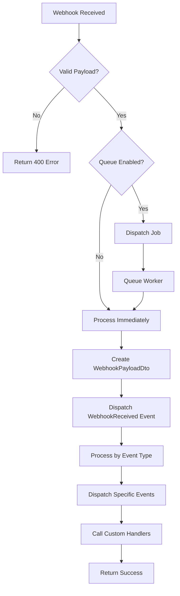

# Processing Webhooks

This guide covers how webhooks are processed by the Laravel Evolution API package.

## Processing Flow



## The WebhookProcessor

The `WebhookProcessor` class is the heart of webhook handling:

```php
use Lynkbyte\EvolutionApi\Webhooks\WebhookProcessor;

class WebhookProcessor
{
    public function process(array $payload): void;
    public function registerHandler(string $event, WebhookHandlerInterface $handler): self;
    public function registerWildcardHandler(WebhookHandlerInterface $handler): self;
    public function enableEvents(): self;
    public function disableEvents(): self;
}
```

### How It Works

1. **Payload Parsing** - Raw payload is converted to `WebhookPayloadDto`
2. **Generic Event** - `WebhookReceived` event is always dispatched
3. **Event Processing** - Specific handler based on event type
4. **Specific Events** - Typed Laravel events dispatched (e.g., `MessageReceived`)
5. **Custom Handlers** - Registered handlers are called

## Synchronous vs Asynchronous

### Synchronous Processing

Webhooks are processed within the HTTP request:

```php
// config/evolution-api.php
'webhook' => [
    'queue' => false,
],
```

**Pros:**
- Simpler setup
- Immediate processing
- No queue infrastructure needed

**Cons:**
- Slower webhook response times
- Can timeout on complex processing
- Not suitable for high traffic

### Asynchronous Processing (Recommended)

Webhooks are queued for background processing:

```php
// config/evolution-api.php
'webhook' => [
    'queue' => true,
],

'queue' => [
    'webhook_queue' => 'webhooks',
    'webhook_connection' => 'redis',
],
```

**Pros:**
- Fast webhook responses (Evolution API gets quick ACK)
- Better reliability
- Handles high traffic
- Retries on failure

**Cons:**
- Requires queue infrastructure
- Slight processing delay

## ProcessWebhookJob

When queuing is enabled, the `ProcessWebhookJob` handles processing:

```php
use Lynkbyte\EvolutionApi\Jobs\ProcessWebhookJob;

// The job is dispatched automatically by WebhookController
ProcessWebhookJob::dispatch($payload, $instanceName)
    ->onQueue('webhooks');
```

### Job Configuration

Configure the job behavior:

```php
// config/evolution-api.php
'queue' => [
    'webhook_connection' => env('EVOLUTION_QUEUE_CONNECTION', 'redis'),
    'webhook_queue' => env('EVOLUTION_WEBHOOK_QUEUE', 'webhooks'),
],
```

### Custom Job Options

You can extend the job to customize behavior:

```php
use Lynkbyte\EvolutionApi\Jobs\ProcessWebhookJob;

class CustomWebhookJob extends ProcessWebhookJob
{
    public $tries = 5;
    public $maxExceptions = 3;
    public $backoff = [10, 30, 60];
    
    public function failed(\Throwable $exception): void
    {
        // Log failure, send notification, etc.
        Log::error('Webhook processing failed', [
            'payload' => $this->payload,
            'error' => $exception->getMessage(),
        ]);
    }
}
```

## Listening to Events

### Using Event Listeners

Create listeners for specific events:

```php
// app/Listeners/HandleIncomingMessage.php
namespace App\Listeners;

use Lynkbyte\EvolutionApi\Events\MessageReceived;

class HandleIncomingMessage
{
    public function handle(MessageReceived $event): void
    {
        $instanceName = $event->instanceName;
        $content = $event->getContent();
        $senderNumber = $event->getSenderNumber();
        $messageType = $event->messageType;
        
        // Process the message
        Log::info("Message from {$senderNumber}: {$content}");
        
        // Maybe send an auto-reply
        if (str_contains($content, 'help')) {
            $this->sendHelpResponse($instanceName, $senderNumber);
        }
    }
}
```

Register in `EventServiceProvider`:

```php
// app/Providers/EventServiceProvider.php
use Lynkbyte\EvolutionApi\Events\MessageReceived;
use Lynkbyte\EvolutionApi\Events\ConnectionUpdated;
use Lynkbyte\EvolutionApi\Events\QrCodeReceived;
use App\Listeners\HandleIncomingMessage;
use App\Listeners\UpdateConnectionStatus;
use App\Listeners\SendQrCodeNotification;

protected $listen = [
    MessageReceived::class => [
        HandleIncomingMessage::class,
    ],
    ConnectionUpdated::class => [
        UpdateConnectionStatus::class,
    ],
    QrCodeReceived::class => [
        SendQrCodeNotification::class,
    ],
];
```

### Using Closures

For simple handling, use closure listeners:

```php
// app/Providers/AppServiceProvider.php
use Illuminate\Support\Facades\Event;
use Lynkbyte\EvolutionApi\Events\MessageReceived;
use Lynkbyte\EvolutionApi\Events\WebhookReceived;

public function boot(): void
{
    // Listen to all webhooks
    Event::listen(WebhookReceived::class, function ($event) {
        Log::info("Webhook received: {$event->event}");
    });
    
    // Listen to specific events
    Event::listen(MessageReceived::class, function ($event) {
        if ($event->isFromGroup()) {
            // Handle group message
        }
    });
}
```

### Queueable Listeners

For heavy processing, queue your listeners:

```php
namespace App\Listeners;

use Illuminate\Contracts\Queue\ShouldQueue;
use Lynkbyte\EvolutionApi\Events\MessageReceived;

class ProcessMessage implements ShouldQueue
{
    public $queue = 'message-processing';
    
    public function handle(MessageReceived $event): void
    {
        // Heavy processing here
    }
}
```

## Available Laravel Events

### WebhookReceived

Generic event for all webhooks:

```php
use Lynkbyte\EvolutionApi\Events\WebhookReceived;

Event::listen(WebhookReceived::class, function ($event) {
    $event->instanceName;    // Instance name
    $event->event;           // Event type string
    $event->webhookEvent;    // WebhookEvent enum
    $event->payload;         // Raw payload array
    
    // Helper methods
    $event->isMessageEvent();
    $event->isConnectionEvent();
    $event->isGroupEvent();
    $event->get('data.key.id');
});
```

### MessageReceived

When a new message is received:

```php
use Lynkbyte\EvolutionApi\Events\MessageReceived;

Event::listen(MessageReceived::class, function ($event) {
    $event->instanceName;
    $event->message;          // Raw message data
    $event->sender;           // Sender info
    $event->messageType;      // MessageType enum
    $event->isGroup;          // Is from group?
    $event->groupId;          // Group ID if applicable
    
    // Helper methods
    $event->getMessageId();
    $event->getSenderNumber();
    $event->getSenderName();
    $event->getContent();
    $event->getQuotedMessage();
    $event->isReply();
});
```

### MessageSent

When a message is sent:

```php
use Lynkbyte\EvolutionApi\Events\MessageSent;

Event::listen(MessageSent::class, function ($event) {
    $event->instanceName;
    $event->messageType;     // Type string
    $event->message;         // Message data
    $event->response;        // API response
});
```

### MessageDelivered

When a message is delivered:

```php
use Lynkbyte\EvolutionApi\Events\MessageDelivered;

Event::listen(MessageDelivered::class, function ($event) {
    $event->instanceName;
    $event->messageId;
    $event->remoteJid;
    $event->data;
});
```

### MessageRead

When a message is read:

```php
use Lynkbyte\EvolutionApi\Events\MessageRead;

Event::listen(MessageRead::class, function ($event) {
    $event->instanceName;
    $event->messageIds;
    $event->remoteJid;
    $event->data;
});
```

### ConnectionUpdated

When connection status changes:

```php
use Lynkbyte\EvolutionApi\Events\ConnectionUpdated;

Event::listen(ConnectionUpdated::class, function ($event) {
    $event->instanceName;
    $event->status;          // InstanceStatus enum
    $event->previousStatus;  // Previous status (if available)
    $event->data;            // Raw data
});
```

### QrCodeReceived

When a QR code is generated:

```php
use Lynkbyte\EvolutionApi\Events\QrCodeReceived;

Event::listen(QrCodeReceived::class, function ($event) {
    $event->instanceName;
    $event->qrCode;          // Base64 QR code image
    $event->pairingCode;     // Pairing code (if available)
    $event->attempt;         // QR code attempt number
    $event->data;
});
```

## Error Handling

### In Event Listeners

```php
class HandleIncomingMessage
{
    public function handle(MessageReceived $event): void
    {
        try {
            // Process message
        } catch (\Exception $e) {
            Log::error('Message processing failed', [
                'instance' => $event->instanceName,
                'message_id' => $event->getMessageId(),
                'error' => $e->getMessage(),
            ]);
            
            // Optionally rethrow to fail the listener
            throw $e;
        }
    }
    
    public function failed(MessageReceived $event, \Throwable $e): void
    {
        // Called when listener fails
        Notification::route('slack', config('services.slack.webhook'))
            ->notify(new WebhookProcessingFailed($event, $e));
    }
}
```

### Global Error Handling

Handle all webhook errors:

```php
// app/Providers/AppServiceProvider.php
use Lynkbyte\EvolutionApi\Exceptions\WebhookException;

public function boot(): void
{
    $this->app['events']->listen('*', function ($eventName, $payload) {
        if (str_starts_with($eventName, 'Lynkbyte\\EvolutionApi\\Events\\')) {
            try {
                // Event will be processed by registered listeners
            } catch (WebhookException $e) {
                Log::channel('webhook-errors')->error($e->getMessage(), [
                    'event' => $eventName,
                    'payload' => $payload,
                ]);
            }
        }
    });
}
```

## Disabling Events

For certain scenarios, you might want to disable event dispatching:

```php
use Lynkbyte\EvolutionApi\Webhooks\WebhookProcessor;

$processor = app(WebhookProcessor::class);

// Disable events
$processor->disableEvents();

// Process webhook without dispatching events
$processor->process($payload);

// Re-enable events
$processor->enableEvents();
```

This is useful for:
- Bulk importing historical webhooks
- Testing without side effects
- Custom processing pipelines
